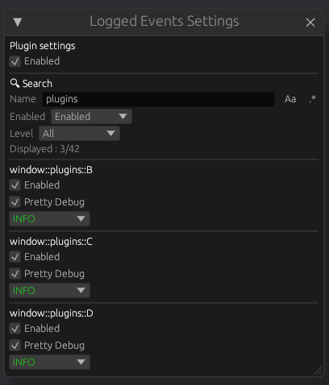

[](https://github.com/YellowWaitt/bevy_log_events#license)
[](https://crates.io/crates/bevy_log_events)
[](https://docs.rs/bevy_log_events)
[](https://bevyengine.org/learn/quick-start/plugin-development/#main-branch-tracking)


# bevy_log_events

[`bevy_log_events`](https://github.com/YellowWaitt/bevy_log_events) is a [Bevy](https://bevyengine.org/) plugin that introduce the `LogEvent` trait for Bevy's App. It will helps you log your `Event` while allowing you to configure independently how each events are logged even during program execution.

## Features

- Easily log your events by adding a single line of code for each of them.
- You can configure independently how each events will be logged using the `LoggedEventSettings<E>` resources.
- Your settings are saved when you exit your application and reloaded the next time you launch it.
- Using [`bevy_editor_pls`](https://github.com/jakobhellermann/bevy_editor_pls) and the `editor_window` feature, you can use a window to edit the settings for all your logged events :



## Usage

Add the crate to your Cargo.toml :
```
cargo add bevy_log_events
```

Then  you just have to add the `LogEventsPlugin` plugin and use the functions from the `LogEvent` trait to log your events :

```rust
use std::time::Duration;

use bevy::{prelude::*, time::common_conditions::on_timer};
use bevy_log_events::prelude::*;

// You must implement Debug for the events you want to log
#[derive(Event, Debug)]
struct MyEvent {
    source: String,
}

fn main() {
    App::new()
        .add_plugins((
            DefaultPlugins,
            // Add the logging plugin
            LogEventsPlugin::new("assets/simple.ron"),
        ))
        // You can now use add_and_log_event instead of add_event to add and log your events
        .add_and_log_event::<MyEvent>()
        // Triggered events can be log too with the use of observers
        .log_triggered::<MyEvent>()
        // Using log_event you can also log external events you did not add yourself
        .log_event::<CursorEntered>()
        .add_systems(
            Update,
            (send_my_event, trigger_my_event).run_if(on_timer(Duration::from_secs(1))),
        )
        .run();
}

// MyEvent will be sent and logged every second at the end of each frame
fn send_my_event(mut events: EventWriter<MyEvent>) {
    events.send(MyEvent {
        source: "sent".into(),
    });
}

// MyEvent will be triggered and logged every second during Update
fn trigger_my_event(mut commands: Commands) {
    commands.trigger(MyEvent {
        source: "triggered".into(),
    });
}

```

## Examples

To run the minimal example from above :
```
cargo run --example simple
```

To run an example with more events and the [`bevy_editor_pls`](https://github.com/jakobhellermann/bevy_editor_pls) window use :
```
cargo run --example window --features editor_window
```

To see a more complete example with triggered events check the copy of the official bevy example of observers :
```
cargo run --example observers --features editor_window
```

## Cargo Features

### editor_window

This feature add an editor window that you can use to edit the `LoggedEventSettings<E>` resources for all the events you have registered.<br>
To use it you will need to add the [`bevy_editor_pls`](https://github.com/jakobhellermann/bevy_editor_pls) as a dependecy of your project and add the `EditorPlugin` to your app before the `LogEventsPlugin`.

### enabled

This feature if removed will entirely disable the `LogEventsPlugin` and the functions from the `LogEvent` trait to make them do nothing. No systems will be added, no resources will be inserted and no logging will occur.

To remove it you can setup your `Cargo.toml` as this :
```toml
[features]
// Create a feature to state that the crate is enabled
dev = ["bevy_log_events/enabled"]
// You may want to set that feature as default
default = ["dev"]

[dependencies]
// Declare that you do not want default-feautres in your dependencies
bevy_log_events = { version = "0.3", default-features = false }
```

Then you can run your program as follow :
```
// If you do not set the feature dev as default do
cargo run --features dev
// Otherwise run your program without default features
cargo run --no-default-features
```

## Note

Events registred with the use of `log_event` or `add_and_log_event` are all logged in the `Last` schedule inside the `LogEventSet` at the end of each frame. So keep in mind that these events will be log with a delay and if many events of different types are send in the same frame they may not be logged in the same order they were sent.

## Bevy Versions Table

| bevy_log_events | bevy | bevy_editor_pls |
| --------------- | ---- | --------------- |
| 0.3             | 0.14 | 0.9 - 0.10      |
| 0.2             | 0.14 | 0.9 - 0.10      |
| 0.1             | 0.13 | 0.8             |
